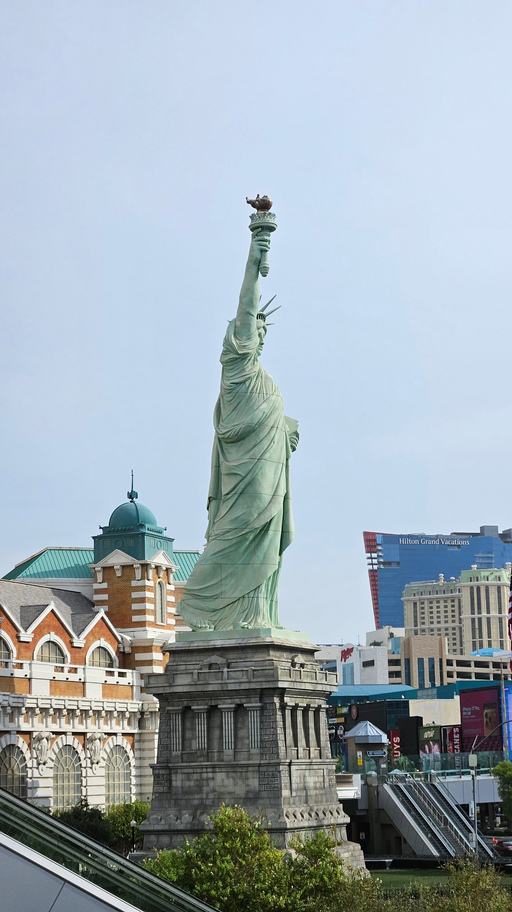
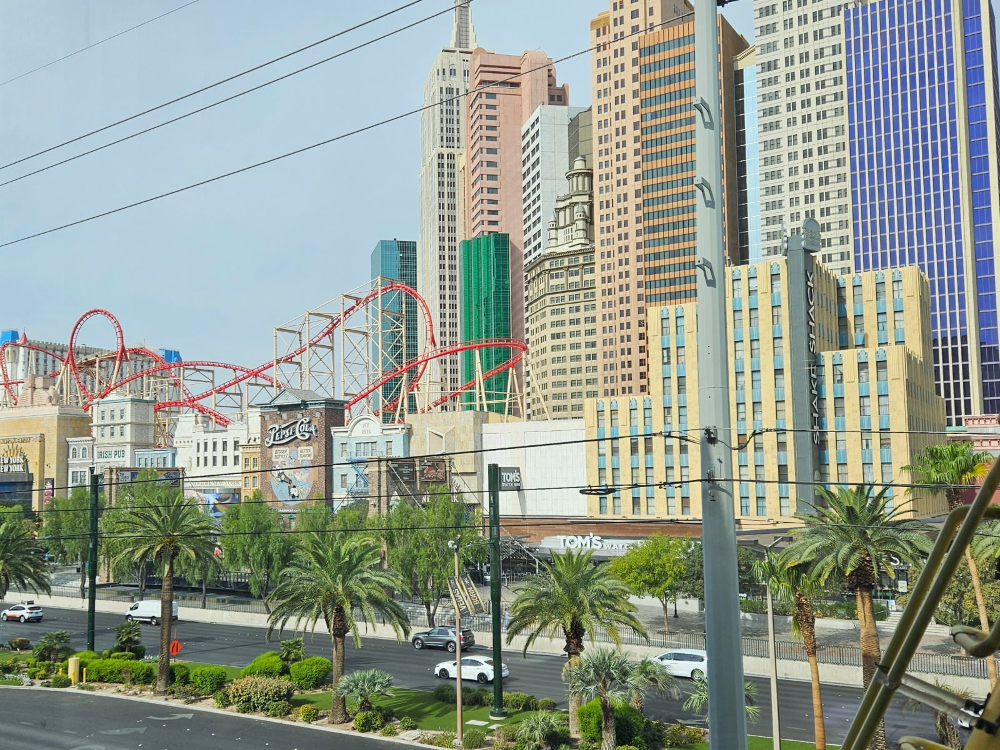
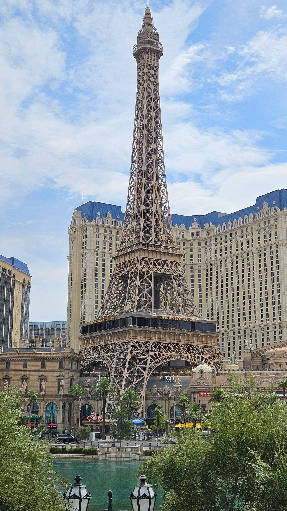
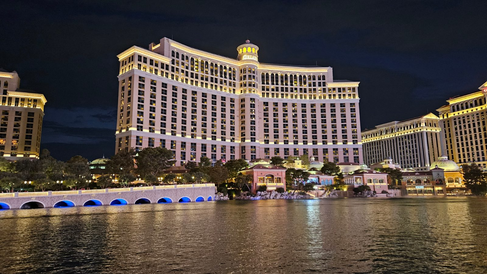
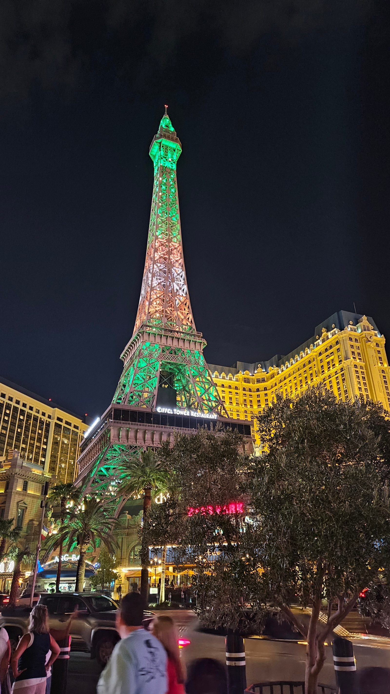
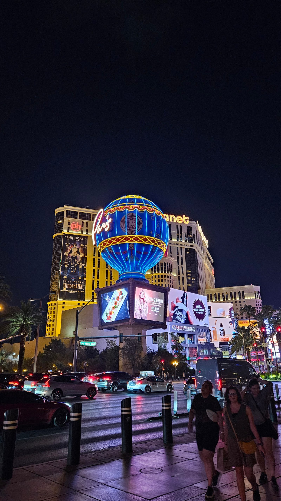
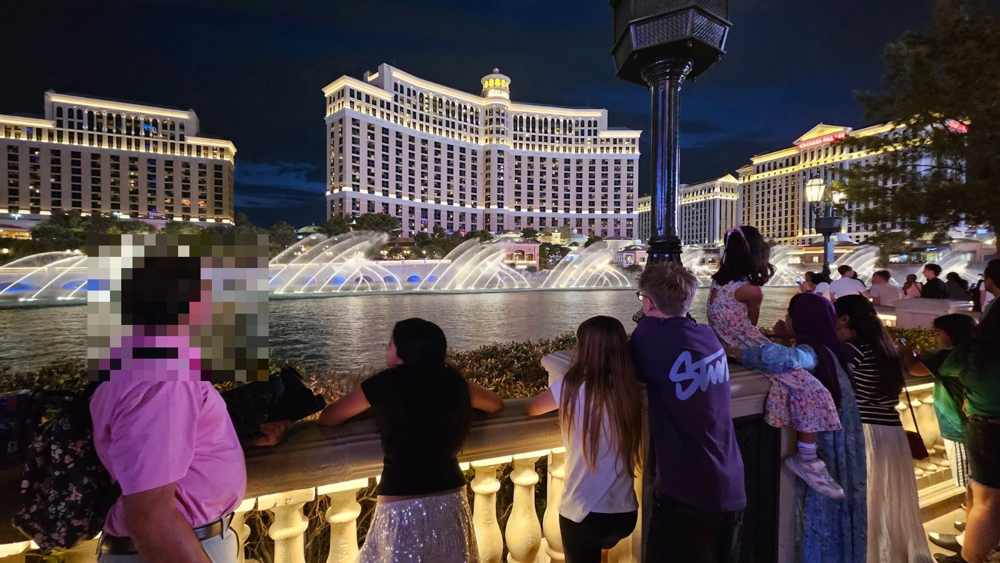

Los ging's um 8:40 Uhr nach dem obligatorischen Kellogg's-Frühstück. Ein
kurzer Abstecher zum Pool diente als Vorabcheck für den Nachmittag, dann zog
es uns Richtung Strip: durch die Casinos, mitten durchs Excalibur, über
zahllose Fußgängerbrücken und den Boulevard hinauf bis etwa auf Höhe
Bellagio.

Vegas ist eine eigene Welt – irgendwo zwischen Shoppingmall und
Freizeitpark, alles mit diesem leicht künstlichen Glanz. Nach rund fünf
Kilometern zu Fuß und dem einen oder anderen Blick in Läden wie Adidas und
Puma waren wir gegen Mittag zurück im Hotel und bereit für den Pool. Über 40
Grad, aber überraschend bewölkt – in Vegas schließt sich das offenbar nicht
aus.

Am Pool ließ es sich mit ein bisschen Wolkenschatten gut aushalten, in
praller Sonne wäre es kaum zu ertragen gewesen. Danach eine ruhige Phase im
Zimmer: ausruhen, ein Nickerchen, etwas lesen.

Abends ging's zur **Cabo Wabo Cantina**, direkt am Bellagio bei den
Wasserspielen, Reservierung um 19 Uhr – Vegas-Preise (ein kleines Bier für
10 Dollar), aber das Essen hat überzeugt. Nach dem Dinner noch zwei Runden
der Bellagio-Wasserspiele mitgenommen, die alle 15 Minuten ihre
Choreografie zeigen. Sehenswert.

Nach so viel Sonne und Strip waren am Ende alle angenehm müde – ein
entspannter Ausklang zurück im Hotel, und schnell reif fürs Bett.
