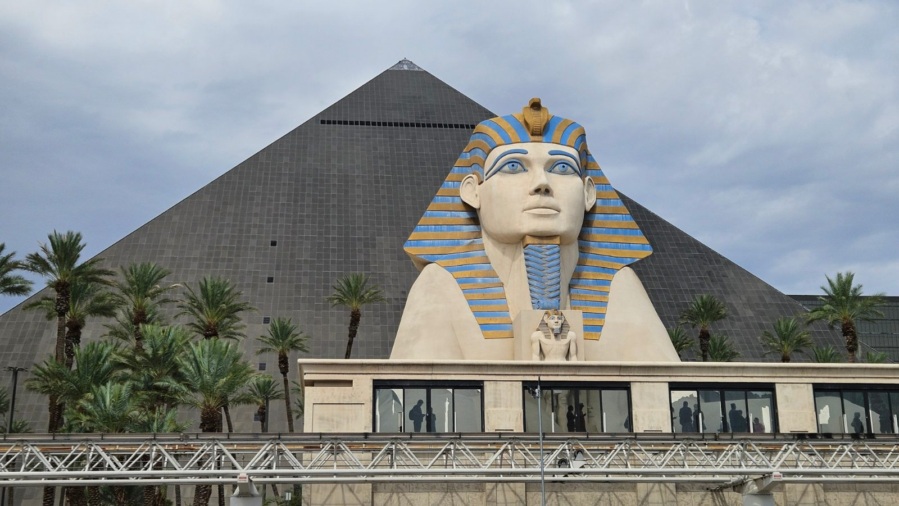
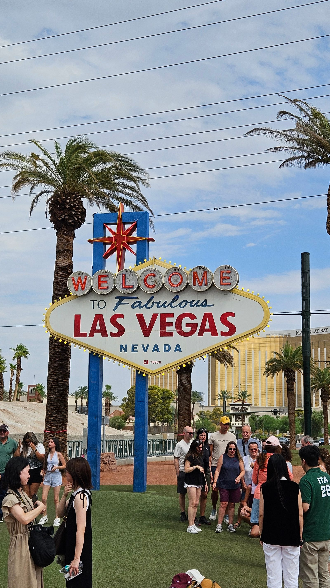
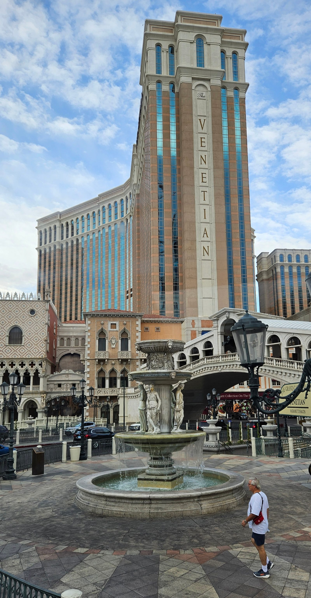
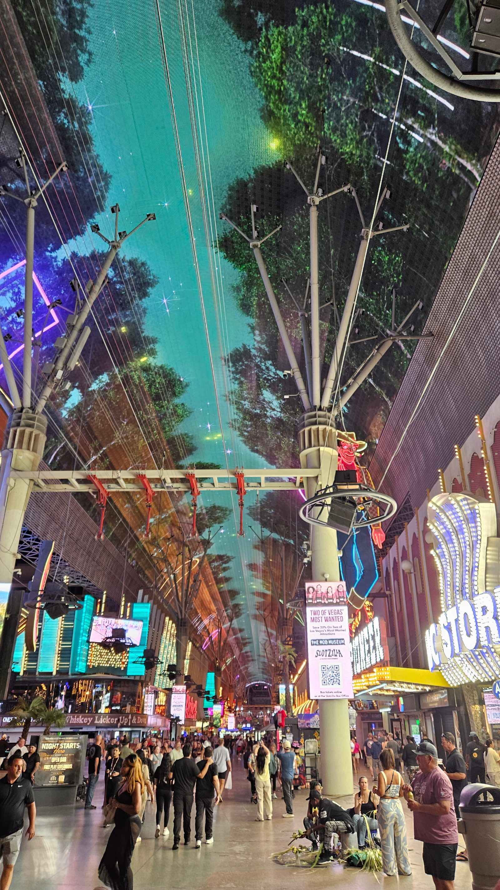
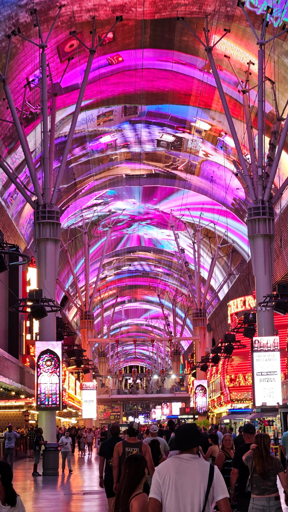

Der letzte Tag in Vegas fing entspannt an: erst ein Foto vom Luxor von
vorne, dann zu Fuß Richtung „Fabulous Las Vegas"-Schild, gut zwei
Kilometer südlich vom Hotel. Das Schild selbst ist cool – der Fußweg
dahin in der Mittagshitze war eher was für Hartgesottene. Danach zügig
zurück zum Luxor und rein in den Pool.

Nach der kurzen, aber sehr willkommenen Abkühlung waren wir uns nicht
ganz einig, was wir mit dem restlichen Tag anfangen sollten – zumindest
bis 16 Uhr, denn da hatten wir schon eine Zaubershow bei Nathan Burton
gebucht. Am Ende haben wir uns fürs Chillen entschieden und sind dann
mit noch genug Zeit für einen kleinen Snack unterwegs losgezogen.

Die Show war richtig cool: von Personen, die spurlos verschwinden, bis
zu klassischen Kartentricks, die einen trotzdem jedes Mal wieder
überraschen, war alles dabei.

Danach ging's mit dem Deuce-Bus Richtung Einkaufs-Mall im Norden von Las
Vegas – ein klassisches Outdoor-Outlet, also keine große Halle, sondern
einzelne Läden entlang einer Art Fußgängerzone. Bei Nike sind wir
fündig geworden.

Mit schon müden Beinen ging's danach trotzdem noch weiter zur Fremont
Street für das Lichtspektakel. Lautstärke, Lichter, die ganze
Atmosphäre – ordentlich Programm für einen Tag, der eigentlich schon
voll war.

Am Ende waren wir froh, wieder im angenehm kühlen Bus zu sitzen. Der
obligatorische Abstecher in den Supermarkt fürs morgige Frühstück
durfte natürlich nicht fehlen. Jetzt liegen die Beine hoch, und es geht
bald früh ins Bett – wobei „früh" gerade eher relativ ist, es ist schon
23:45 Uhr. Zeitgleich fangen die Kollegen in Deutschland gerade erst
mit der Arbeit an.

**Planänderung für morgen:** Beim Anruf bei Cruise America haben wir
erfahren, dass der früheste Abholtermin fürs Wohnmobil erst um 14:15
Uhr ist – damit hatten wir ehrlich gesagt nicht gerechnet. Heißt: wir
müssen morgen zügig durchfahren zum Grand Canyon, bei einer reinen
Fahrzeit von über vier Stunden. Der Campground erlaubt zwar auch eine
spätere Anreise mit Check-in erst am nächsten Morgen, aber die
Nachtruhe beginnt um 22 Uhr – das ist unsere Grenze.

Aus dem Hotel müssen wir um 11 Uhr raus, die Taschen können wir aber
irgendwo einlagern. Heißt: morgen früh bleibt noch ein bisschen Zeit
zum Poolen, bevor es dann mit dem Uber (ca. 35 Minuten) zur
Wohnmobil-Übernahme geht.
