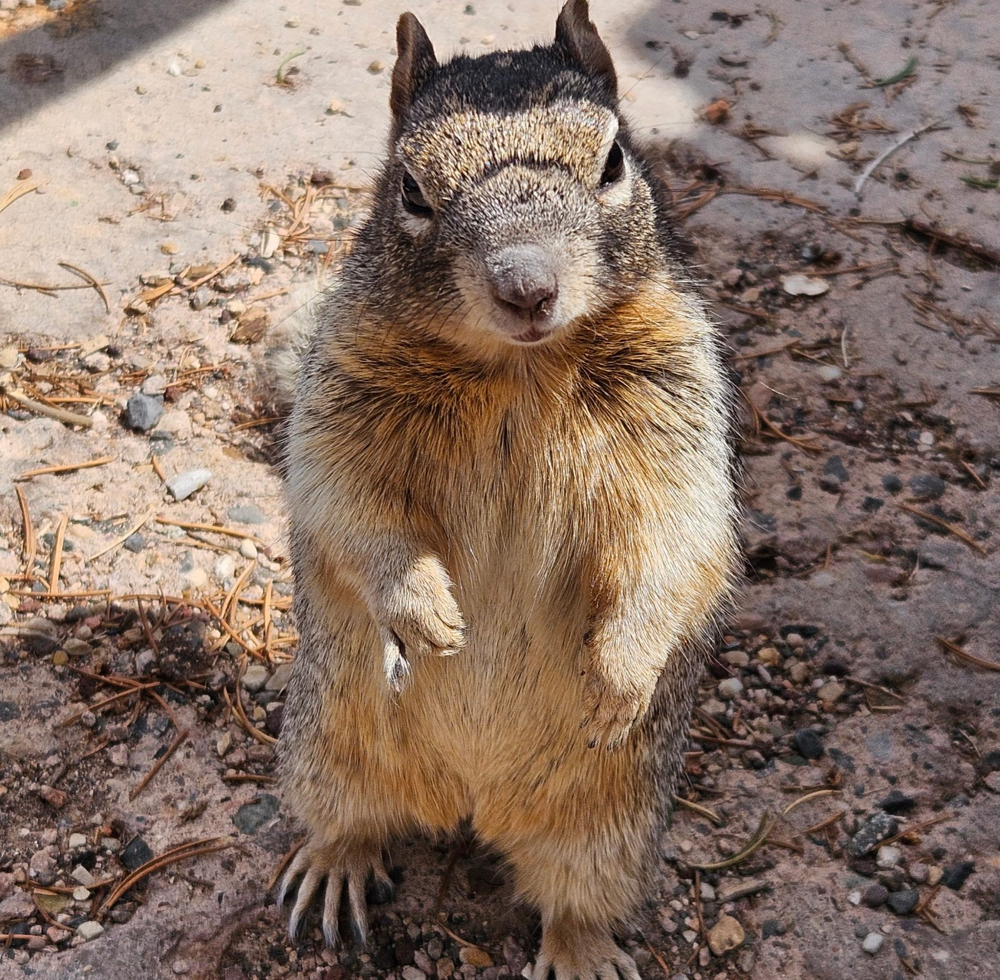
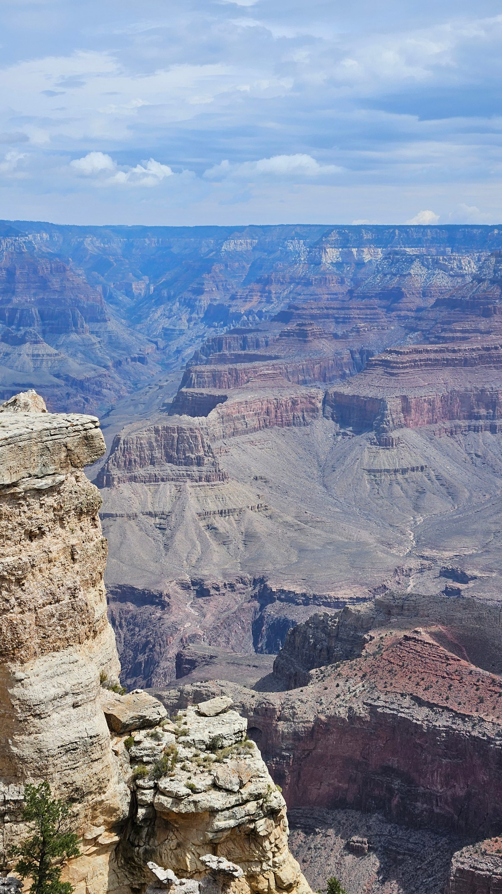
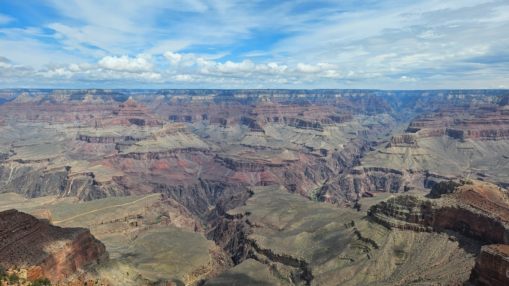
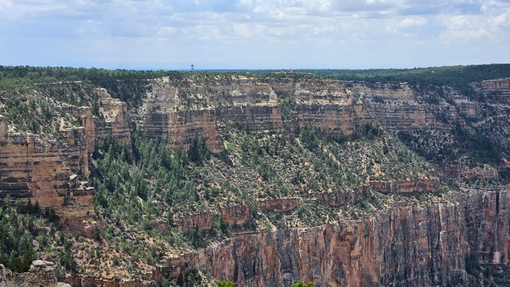
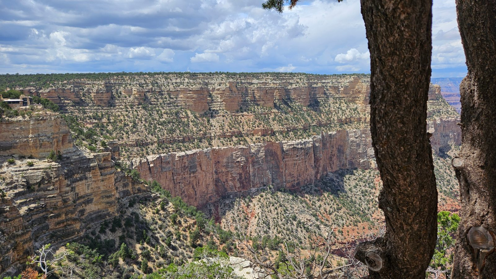
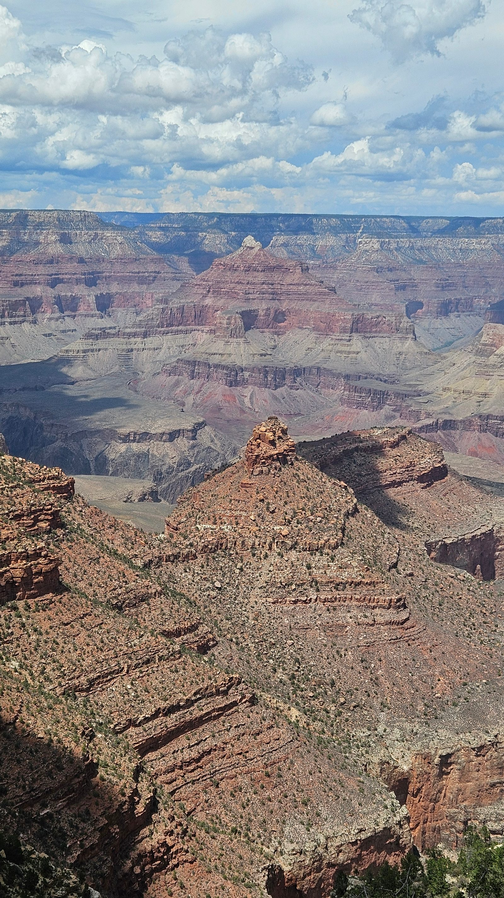
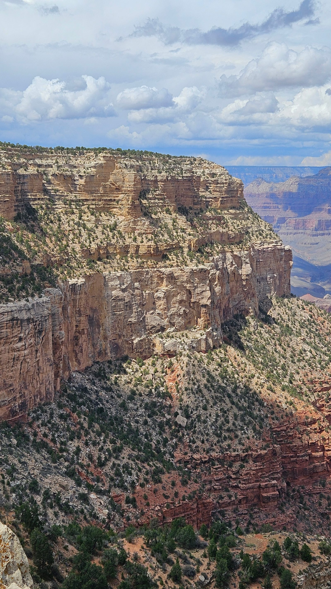
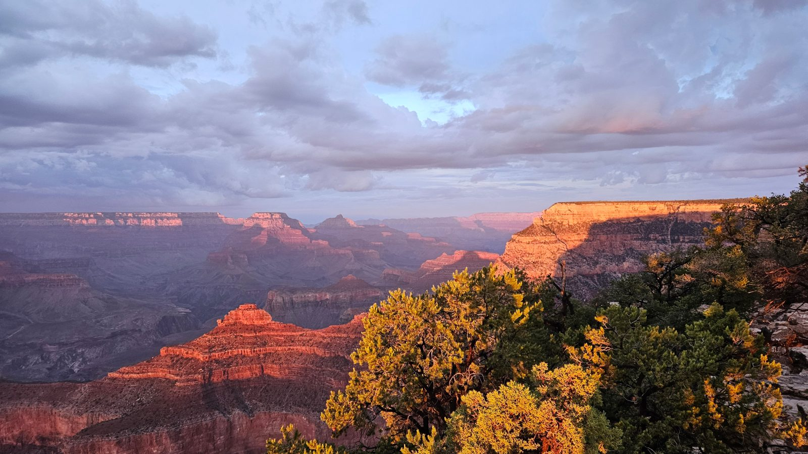
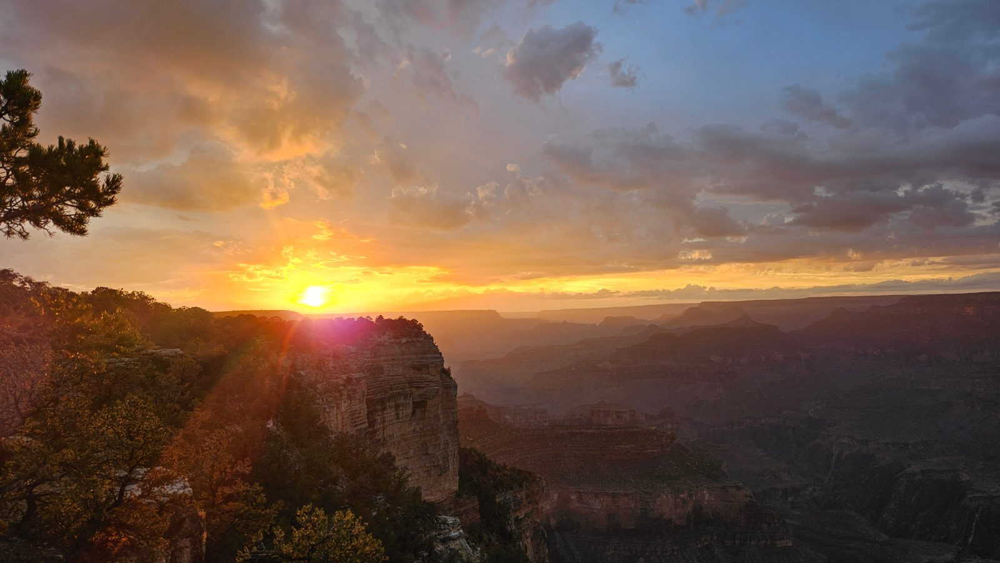

Heute sind wir am Mather Campground aufgewacht. Die erste Nacht im
Wohnmobil war gut, bequem und traumlos – nach dem Reisetag und der ganzen
Aufregung hatten das alle auch nötig.

Morgens war ich noch nicht ganz umgezogen, da konnte ich beobachten, wie
ein Wapiti vor unserem Wohnmobil entlangschlenderte – der Busfahrer nannte
es später „elk", was im Deutschen fälschlicherweise oft mit Elch übersetzt
wird, tatsächlich aber der Wapitihirsch ist (echte Elche gibt's hier gar
nicht). Anscheinend sind die Tiere hier an Menschen gewöhnt und nicht mehr
scheu. Natur pur – auch Eichhörnchen, winzige Streifenhörnchen und Raben
sind hier oft zu sehen.

Die Mädels haben uns noch kurz am Campingplatz eingecheckt, währenddessen
haben wir die Staufächer sortiert und den Tisch gedeckt.

Frühstück gab's draußen auf der steinernen Bank, die zu jedem Stellplatz
gehört – dazu Kaffee ganz klassisch: Wasser auf dem Herd aufgekocht und
den Filter von Hand aufgegossen. Eine Feuerstelle gibt's ebenfalls,
Feuermachen ist wegen der Trockenheit allerdings strikt verboten.

Vom Campingplatz aus fahren alle zehn Minuten kostenlose Shuttlebusse, die
eine kleine Rundtour machen – ein sehr engagierter Busfahrer hat uns
freundlich begrüßt. Eine willkommene Abwechslung zu Las Vegas.

Wir sind direkt am Grand Canyon Visitor Center ausgestiegen und mit
Spannung zum „Rim" spaziert, wie hier die Schluchtkante heißt, an der man
knapp zwei Kilometer entlanglaufen kann. Den Grand Canyon selbst kann man
kaum in Worte fassen – vielleicht helfen die Bilder. Besonders gefallen
hat uns aber die gesamte Aufmachung: gepflegte Wege, kleine
Souvenirgeschäfte und durchweg freundliches Personal.

Weil etwas Regen angekündigt war, sind wir nach dem zwei Kilometer langen
Spaziergang mit zahlreichen Abstechern und Fotopausen wieder mit dem
Shuttle zurückgefahren.

Wenn das Wetter mitspielt, fahren wir gleich nochmal zum Rim, um den
Sonnenuntergang anzuschauen.

