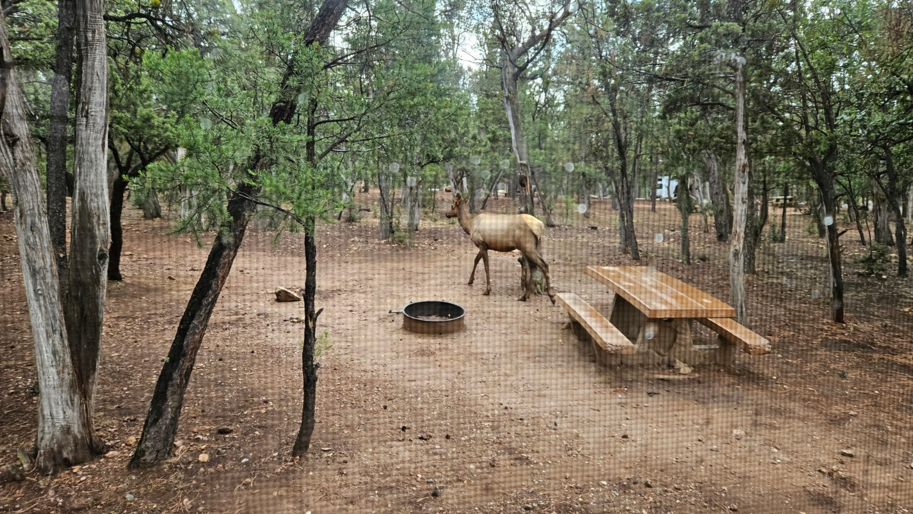
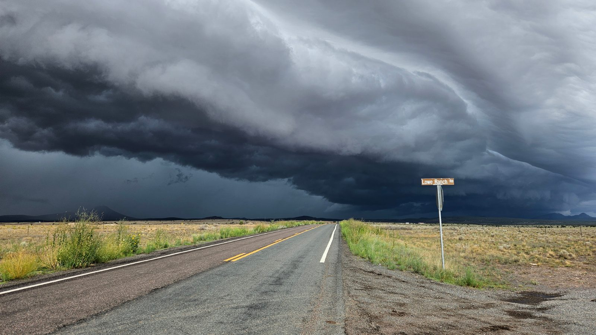
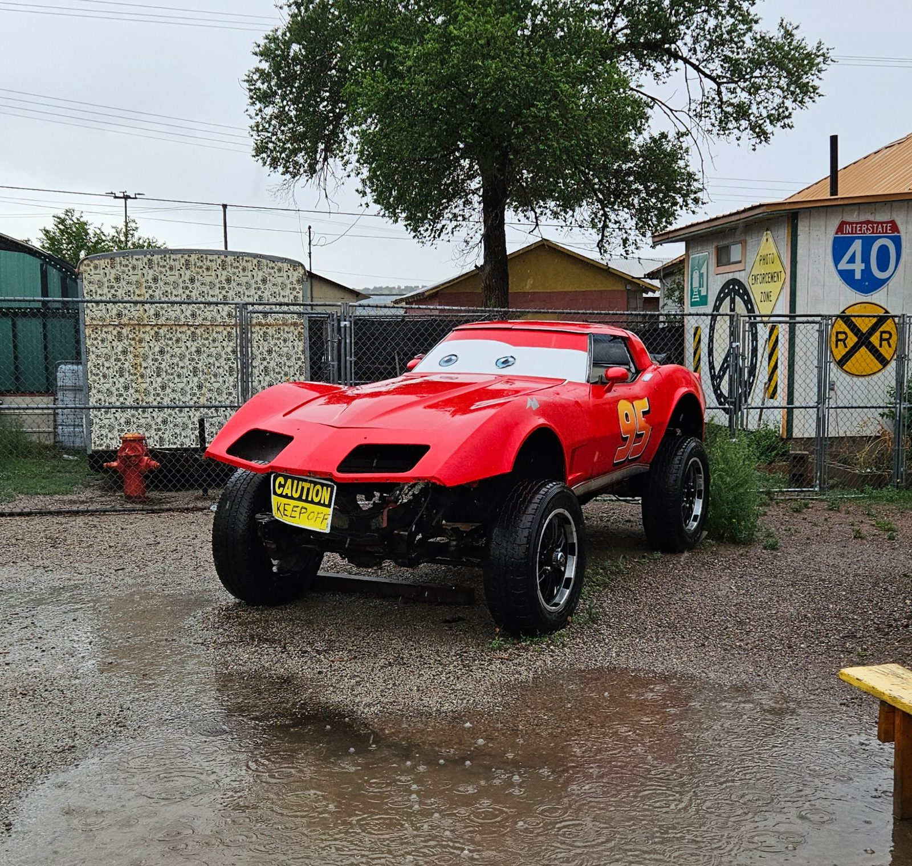
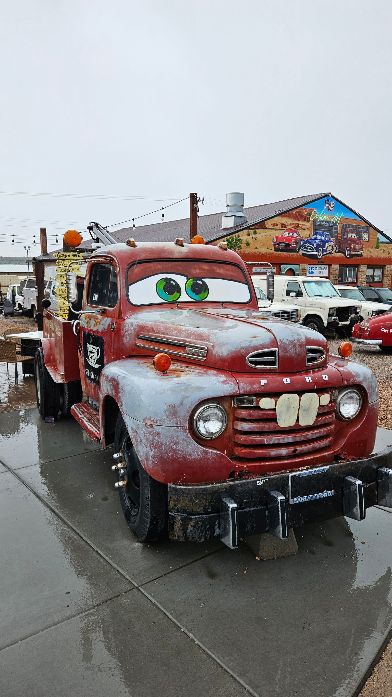
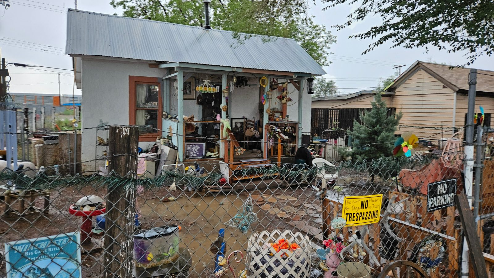
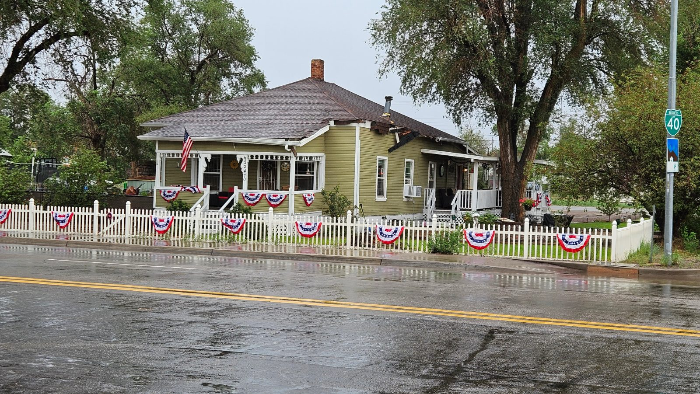
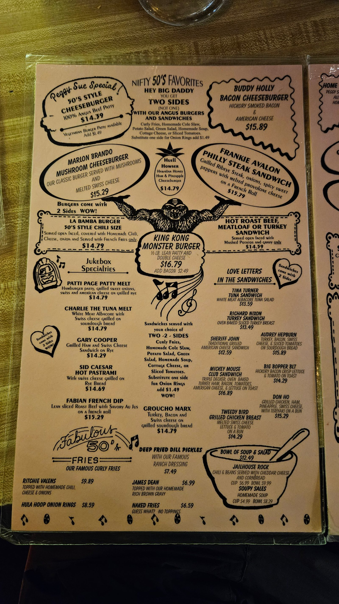
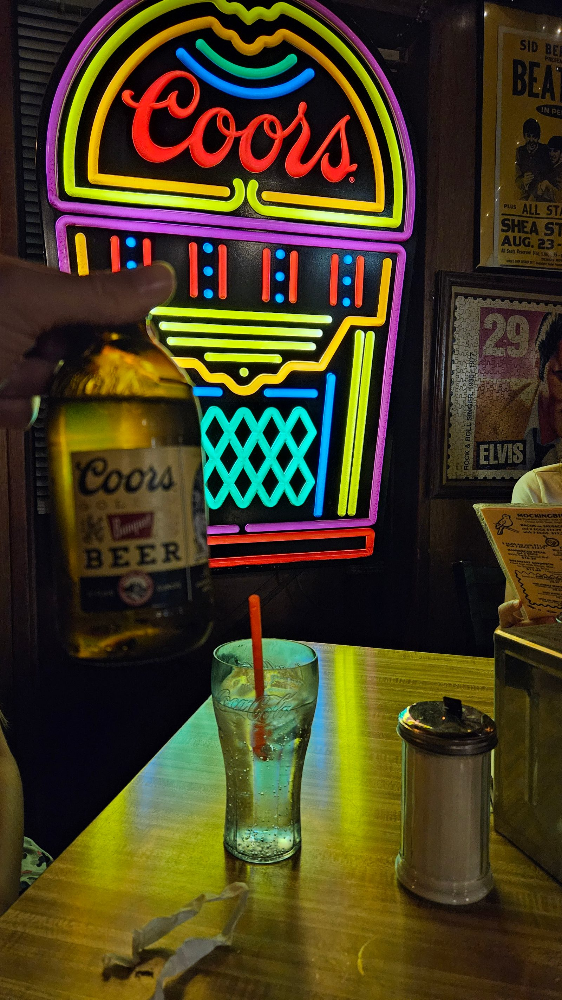

Der Morgen fing mit Überraschungsbesuch an: ein Wapiti, gemütlich zwischen
den Bäumen direkt am Campingplatz unterwegs, beim Blick aus dem Fenster.
(Wird hier oft fälschlich Elch genannt – echte Elche gibt's in der Gegend
gar nicht.)

Dann ging es von der South Rim weiter Richtung Westen, ein Stück davon
sogar auf einem Originalabschnitt der Route 66 – ein paar Meilen echter
alter Asphalt statt Interstate. Kurz vor Seligman zog ein ordentliches
Gewitter auf.

Der erste Stopp, Seligman, geriet dadurch etwas verregnet. Trotzdem sind wir
durch den Ort gelaufen, vorbei an alten Autos – darunter ein Lightning
McQueen- und ein Mater-Nachbau aus "Cars" – und kurz in einem Souvenirladen
gestöbert.

Weiter ging's zum Walmart in Kingman – ein wirklich riesiger Laden, in dem
über 100 Dollar hängengeblieben sind. Dafür sind wir jetzt als
Selbstversorger für Sequoia und Yosemite gerüstet, inklusive der
Toilettenchemie, die uns bis dahin gefehlt hatte. Bemerkenswert: An der
Kasse wurde fast jedes einzelne Teil in eine eigene Plastiktüte gepackt –
typisch amerikanisch, und beim Zusehen war das Staunen groß.

Auf dem Barstow/Calico KOA angekommen, gab es Strom- und Wasseranschluss,
nur das Abwasser musste separat abgelassen werden. Dabei gleich die Lektion
des Tages gelernt: dass das WC-Ventil wirklich dicht ist, sollte man nicht
einfach annehmen – und wenn, dann nur mit Handschuhen. Beim nächsten Mal
wissen wir's besser.

Der Platz liegt mitten in der Wüste direkt an einer stark befahrenen
Straße, entsprechend laut. Trotzdem war eine gute Stunde im Pool genau das
Richtige nach der langen Fahrt.

Zum Abendessen sind wir mit dem Wohnmobil rüber zu Peggy Sue's 50's Diner –
zu Fuß keine gute Idee so nah an der Autobahn und bei einbrechender
Dunkelheit. Gegessen haben wir gut, aber ohne Schnickschnack – solide
Hausmannskost, der Burger ganz ohne ausgefeilte Soße, dafür mit Ketchup aus
der Flasche. Das Ambiente hat's dann rausgerissen: sehr amerikanisch,
überall Elvis- und Marilyn-Monroe-Fotos.

