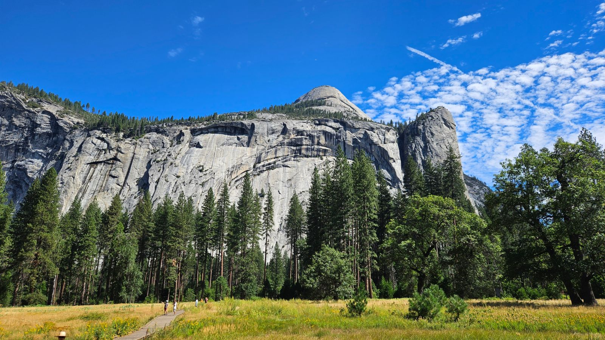
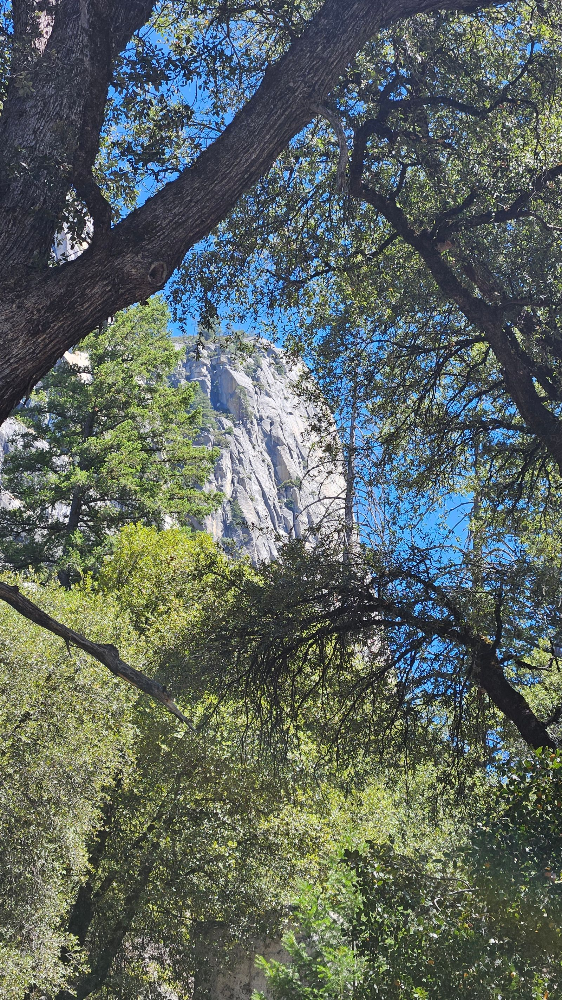
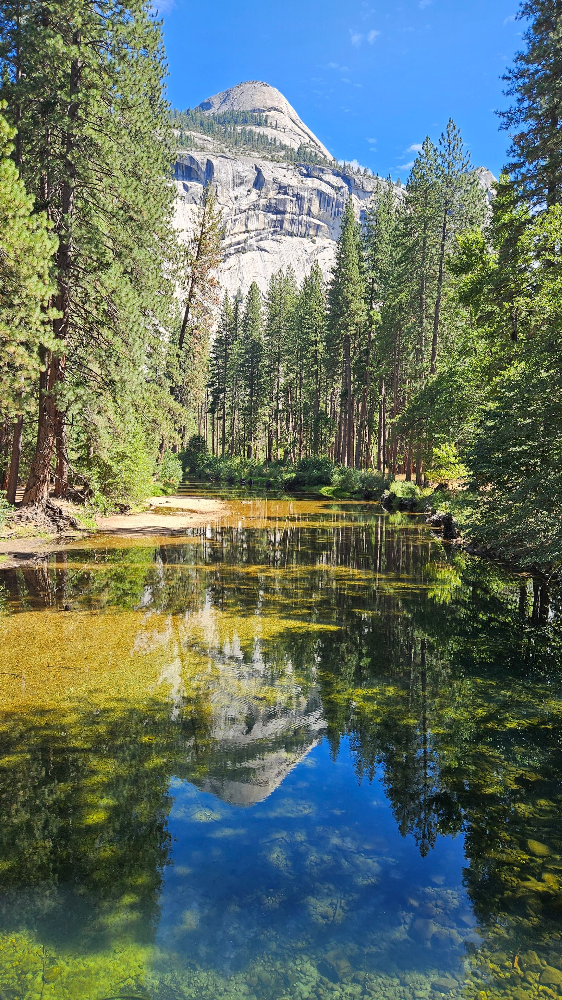
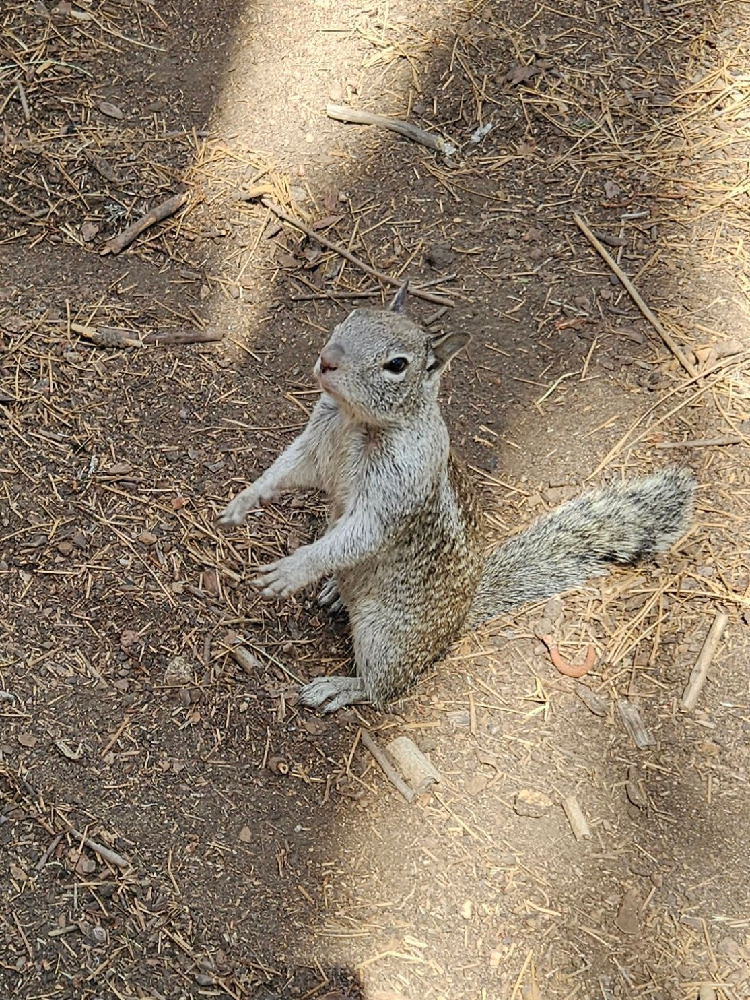
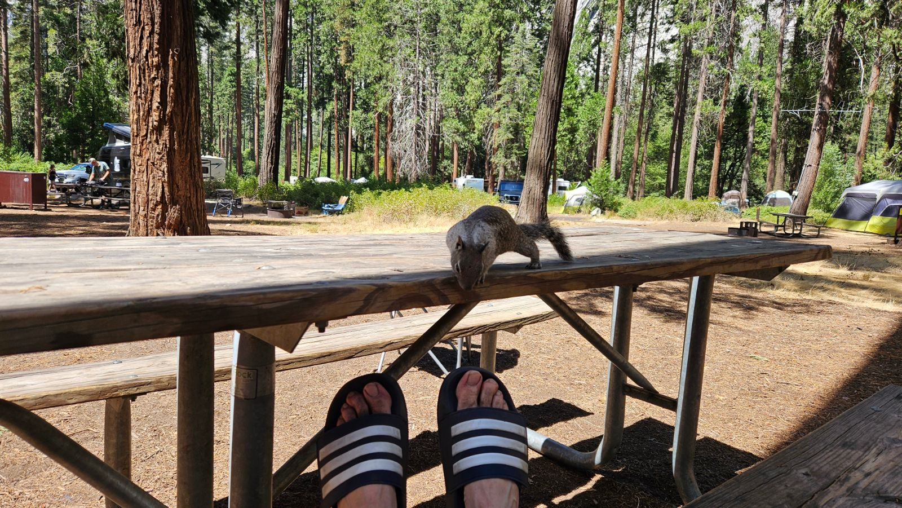

Vom Visitor Center ging's nördlich an der Felskante entlang, durch einen
schmalen Waldstreifen mit riesigen Felsbrocken, die offensichtlich
irgendwann vom Bergmassiv abgebrochen sind.

Eigentlich wollten wir bis zum Mirror Lake im Osten, ganz geschafft haben
wir es nicht – kurz vorher sind wir Richtung Happy Isles abgebogen.

Am Wasser entlang ging's zurück zum Lower Pines Campground, wo uns gleich
ein neugieriges Erdhörnchen am Picknicktisch begrüßt hat.

Nach einer kurzen Pause ging's zur Abkühlung in den Fluss – aktuell eher
ein Bach, aber schon kalt und erfrischend. Auch ohne Wasserschuhe kommt man
über die rund gewaschenen Steine, an den hüfttiefen Stellen war das genau
richtig gegen die Hitze.

Später noch ein Abstecher ins Curry Village: großer Parkplatz, ein Laden
für Souvenirs und Lebensmittel, ein paar Restaurants. Die Jungs sind noch
eine Runde am Fluss entlang gejoggt, diesmal bis zu einem Anstieg, den sie
auch noch ein paar Höhenmeter hochgenommen haben.

Zum Leeren des Abwassertanks sind wir kurz vom Campingplatz gefahren, dort
gab es auch Wasser – kurz die Haare waschen und kalt abduschen war drin.
Beim Abendessen hat uns dann noch eine freundliche Rangerin besucht und an
die Bären-Regeln erinnert. Das Thema ist hier omnipräsent, überall hängen
Hinweisschilder.

Abends am Lagerfeuer, dazu ein lautes Zirpkonzert und der Blick in den
Sternenhimmel. Gegen halb zehn war den Mädels die Luft raus, sie haben sich
schon ins Bett gekuschelt – ich habe noch gewacht, bis das Feuer von selbst
ausging. Auf dem Campingplatz gibt's übrigens keinen Empfang, deshalb
entsteht dieser Text komplett offline.
