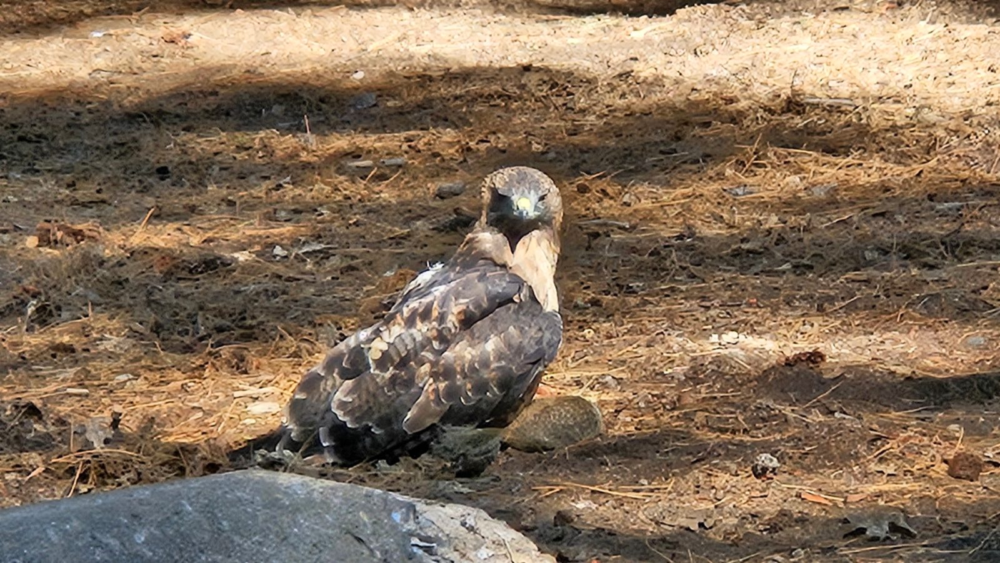
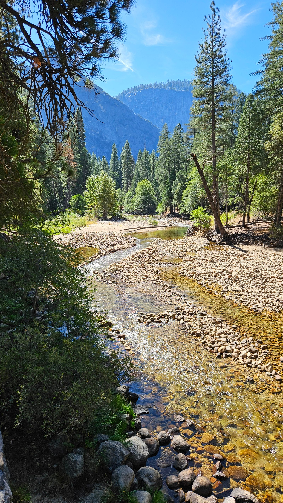
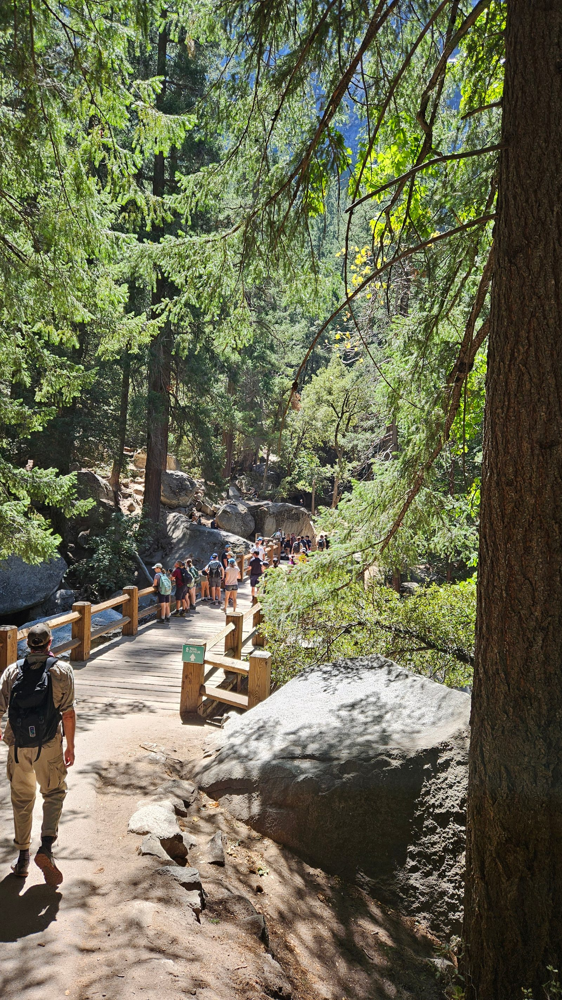
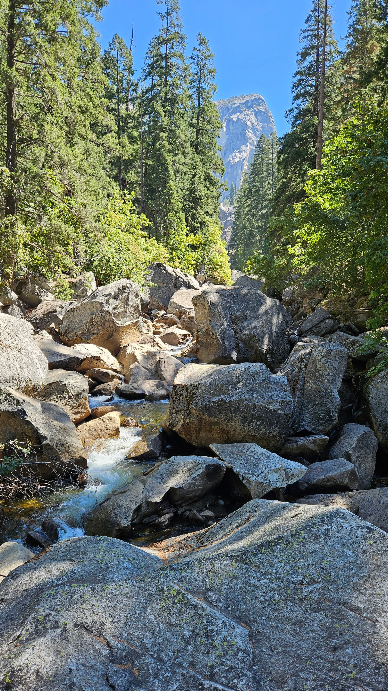
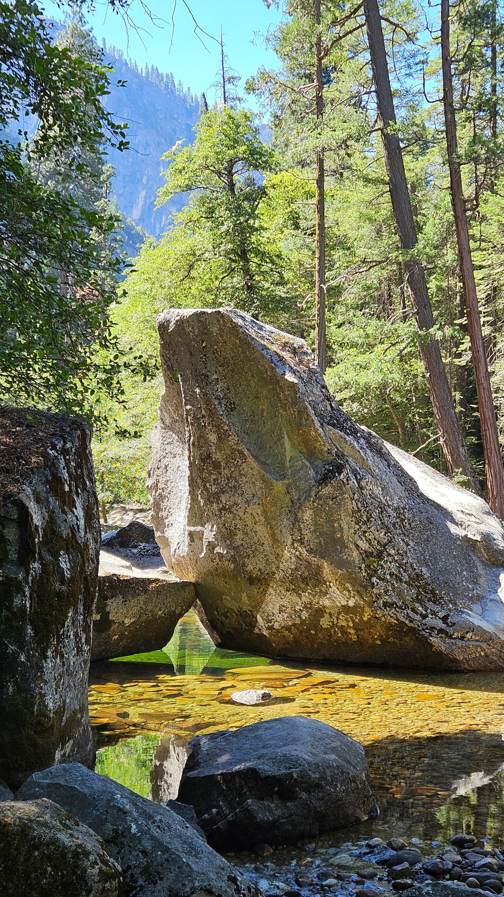
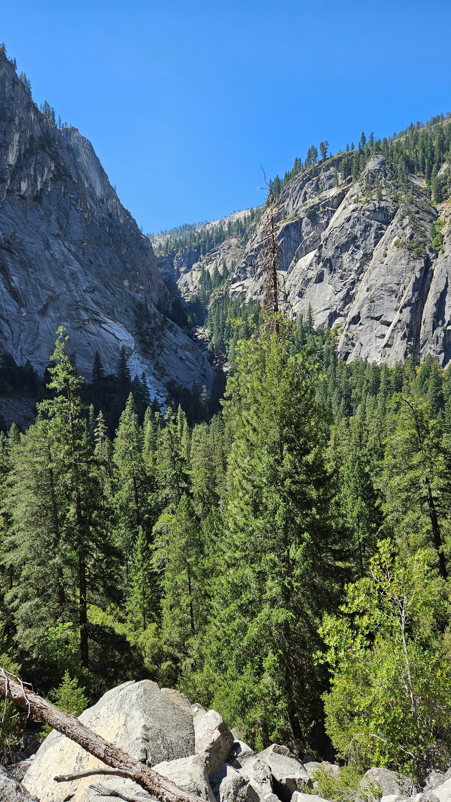
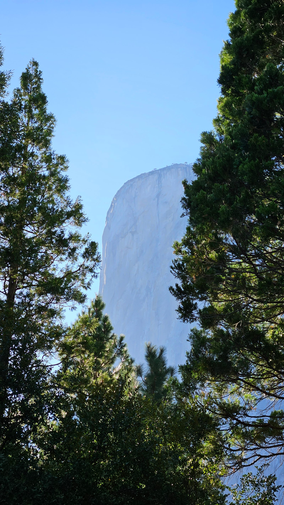
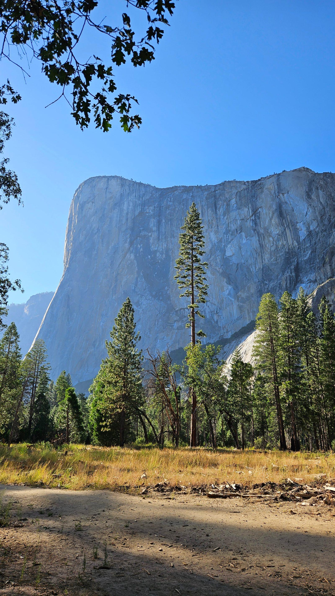
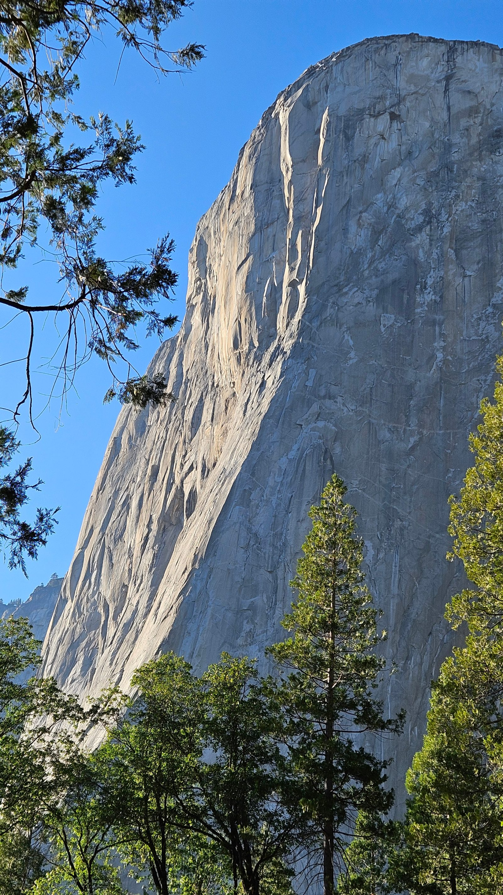

Der Morgen läuft inzwischen nach Schema: Ich bin zuerst wach, um halb acht
Kaffee am Campingplatz und ein bisschen gelesen, um neun Frühstück
zusammen, bis halb elf dauert Packen und Losfahren – aber immerhin mit
Plan. Kurz bevor wir den Platz verlassen, dann unerwartetes Drama: Ein
großer Greifvogel schnappt sich direkt vor unseren Augen eines der
Eichhörnchen und setzt sich damit an den Wegesrand, völlig unbeirrt von
uns und einem vorbeifahrenden Auto.

J. und ich sind gestern schon in diese Richtung gejoggt – und erst
hinterher gemerkt, dass wir dabei auf dem John Muir Trail unterwegs waren,
einem der beliebtesten Wanderwege im Tal. John Muir (1838–1914) war die
treibende Kraft hinter der Gründung von Yosemite als Nationalpark 1872 und
Gründer des Sierra Club; der nach ihm benannte Trail führt 211 Meilen von
Yosemite bis zum Mount Whitney, dem höchsten Berg der unteren 48 Staaten.

Der Trail geht bis zum Half Dome hinauf und an zwei Wasserfällen vorbei –
so weit sind wir nicht gekommen, der erste war gesperrt, der zweite zu
weit oben für unsere Kondition. Zurück ging's denselben Weg. Einen
zweiten Weg, den Stock Trail, hatten wir auf der Karte entdeckt – der ist
aber nur für Maultiere freigegeben, die Proviant zu den Berghütten
bringen, für Wanderer gesperrt.

Gegen 17 Uhr ging's nochmal los, mit dem kostenlosen Shuttle zum El
Capitan. Beeindruckend im Licht der tiefstehenden Sonne, die massive
Granitwand zwischen den Pinien – die Lichtstimmung kommt in den Fotos
besser rüber als in Worten.

