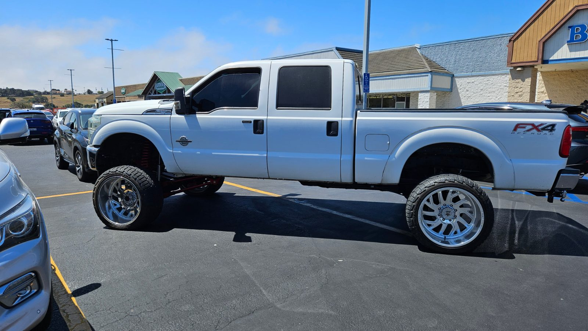
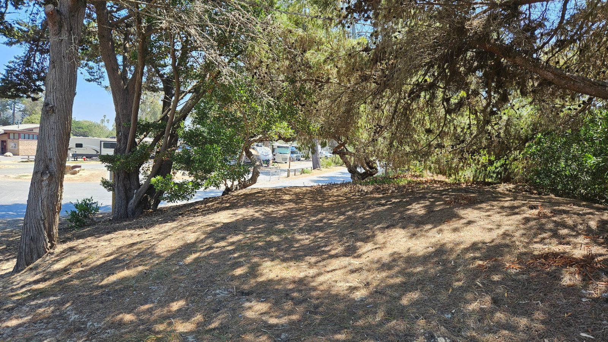
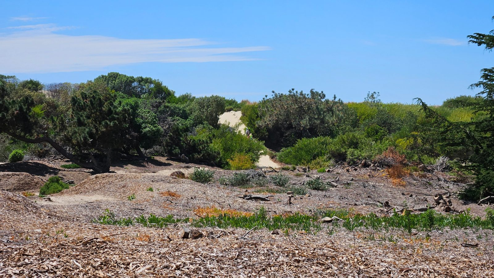
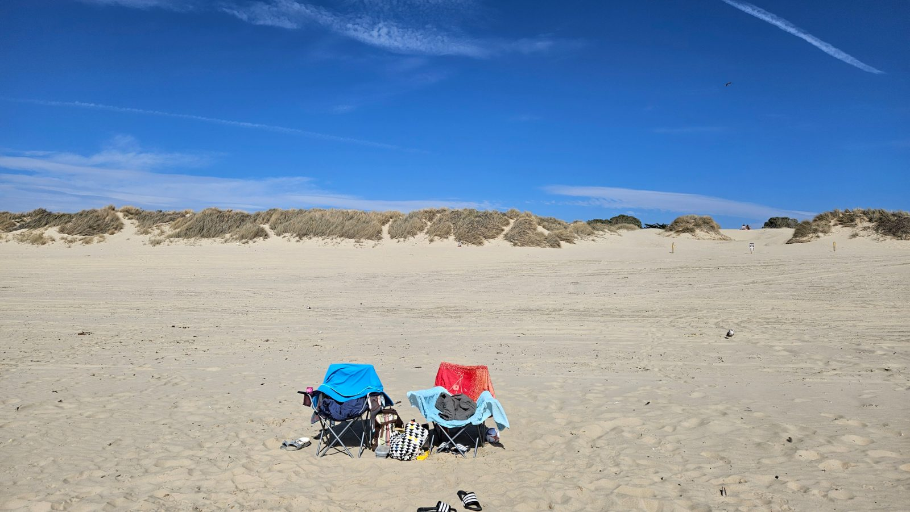
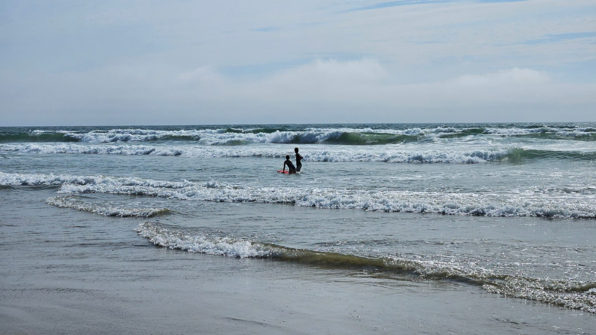
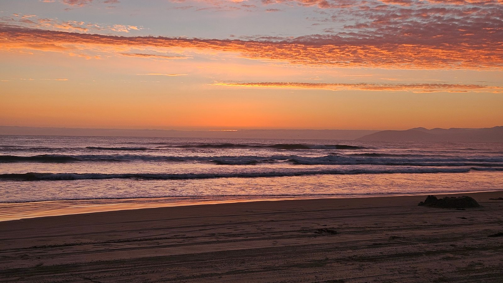
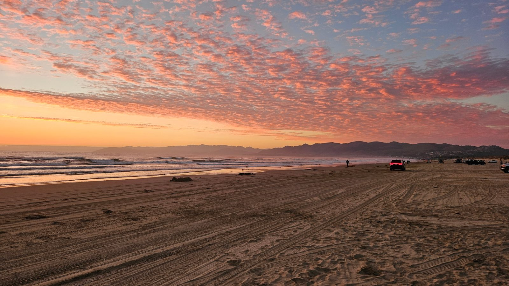
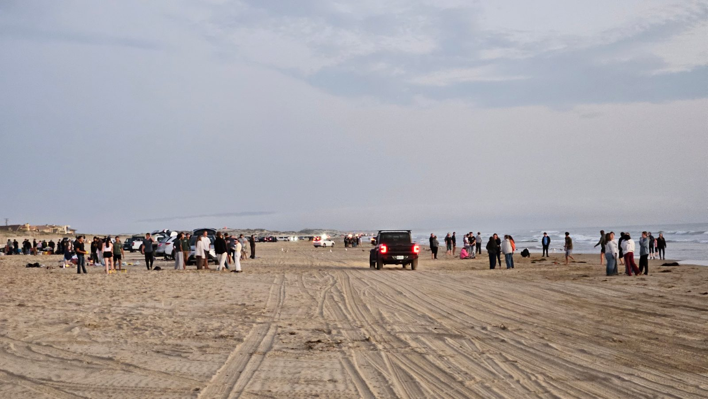

Der Tag hat mit Pancakes aus der Packung begonnen – ganz ohne Ei und
Milch, aber trotzdem lecker, dazu ein zuckerfreier Sirup mit
Ahorn-Geschmack, der sich offiziell nicht „Ahornsirup" nennen darf, weil
wohl kein echter drin steckt.

Die Kinder wollten unbedingt ein Bodyboard, außerdem brauchten wir
Bargeld. Der Automat im kleinen Strandshop war uns nicht ganz geheuer,
also erst zur Bank, danach zu Walmart – Bodyboard gab's dort keins, dafür
einen kleinen Fußball und eine Ballpumpe. Fündig wurden wir schließlich in
einem Sportgeschäft im Gewerbegebiet ganz in der Nähe: 35 % Rabatt auf den
ausgezeichneten Preis, am Ende 27 Dollar – genau so viel, wie im
Strandshop verlangt worden wäre. Jetzt haben wir ein Bodyboard, das
möglicherweise als Sperrgepäck mit nach Hause fliegt. Auf dem Parkplatz
stand nebenbei ein für unsere Augen absurd hochgelegter Pick-up – hier
offenbar völlig normal.

Kaum zurück, ging's an den Strand, durch die Dünen und über einen
Sandweg vom Campingplatz – auch um das Bodyboard gleich auszuprobieren.

Der kleine Fußball hat sich schon mal gelohnt, und auch das Bodyboard,
auch wenn L. die Stärke der Wellen wohl unterschätzt hat. L. und ich haben
etwas geübt, wie man sich damit gegen die Brandung fortbewegt, ohne von
der Strömung mitgerissen zu werden. Nebenbei lief eine kleine Wette mit
J.: Er behauptete, der Pazifik könne unmöglich so kalt sein wie der
Merced River im Yosemite. Zugegeben, so kalt ist er tatsächlich nicht –
allerdings machen Wellengang und Wind die Einschätzung schwieriger, man
friert hier einfach schneller. Punkt trotzdem an J.

Gegen halb sechs waren wir zurück am Wohnmobil. Die deutschen Nachbarn,
mit denen wir am Vorabend noch geplaudert hatten – auch mit einem Cruise
America unterwegs, allerdings ein halbes Jahr lang – waren da schon
abgereist. Dafür kam am Abend unser Nachbar Brian vorbei, komplett auf
Englisch, und erzählte uns ein Stück seiner Lebensgeschichte. Zum
Abschied schenkte er uns ein Plastik-Ei mit einem gefalteten Dollarschein
darin: Man soll es morgens als Erstes sehen und sich daran erinnern,
dankbar zu sein – für die eigene Gesundheit, für Familie und Freunde.
Brian selbst hat eine schwere Erkrankung; das Verteilen der Eier und die
Gespräche mit Leuten scheinen ihm zu helfen, sich von den Schmerzen
abzulenken.

Zum Abendessen gab's improvisierten Nudelsalat mit Ranch-Soße und ein
paar Frühstücksbratwürstchen, zum Ausklang das Lagerfeuer: zwei von vier
Walmart-Maiskolben sollten darauf gar werden, brauchten aber ihre Zeit,
das Feuer wollte lange keine richtige Glut liefern. Nebenbei gab's noch
ein geröstetes Marshmallow mit Oreo-Keks. Passend zum Tag am Meer dann
gegen 19:45 Uhr ein Sonnenuntergang, den wir uns kurz angesehen haben –
Autos fahren hier übrigens einfach über den Sand bis ans Wasser,
offenbar ganz normal am Pismo Beach.

