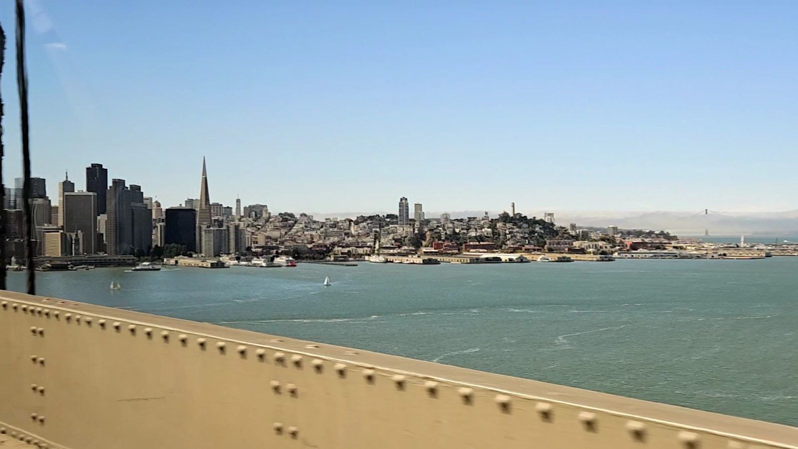
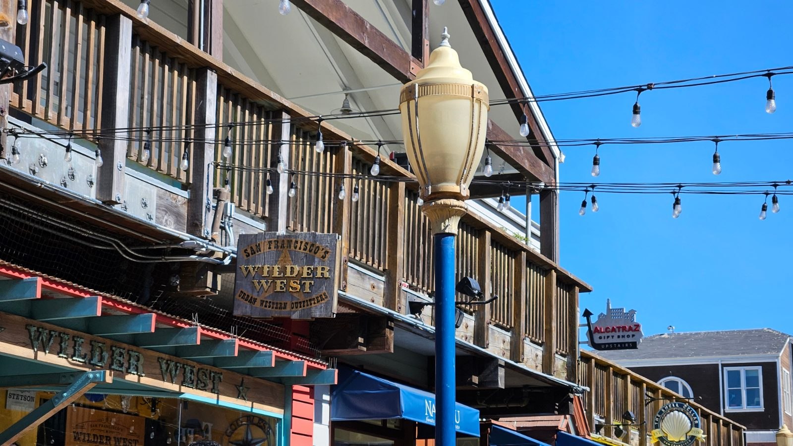
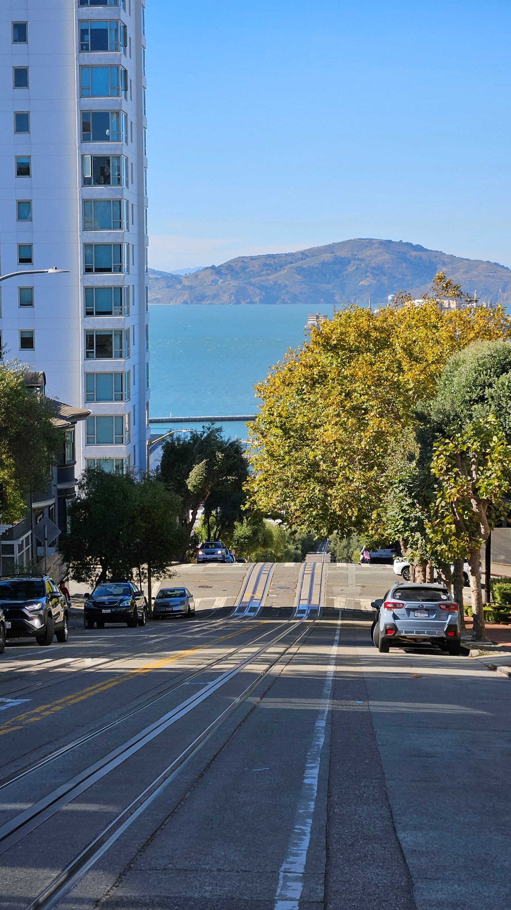
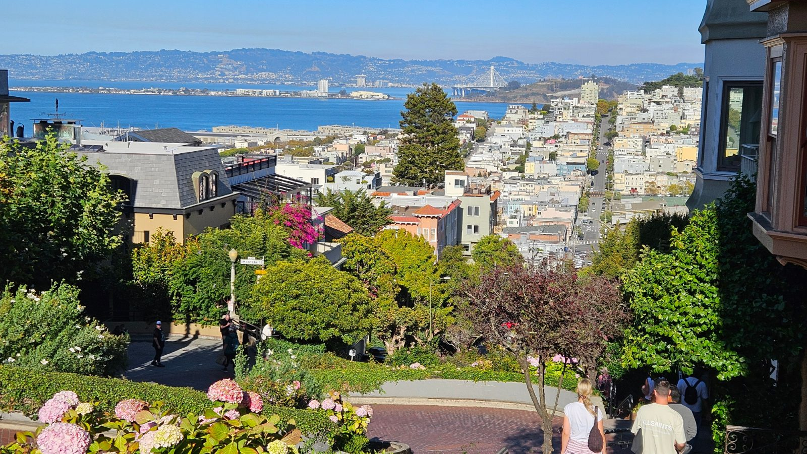
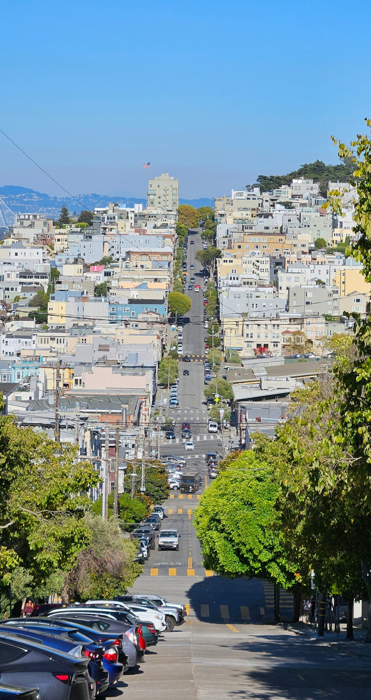
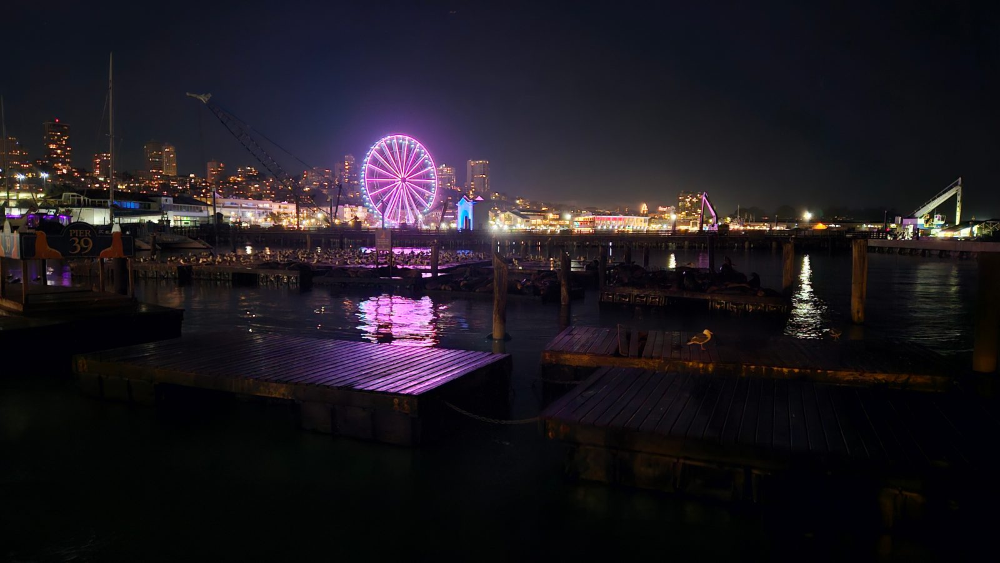
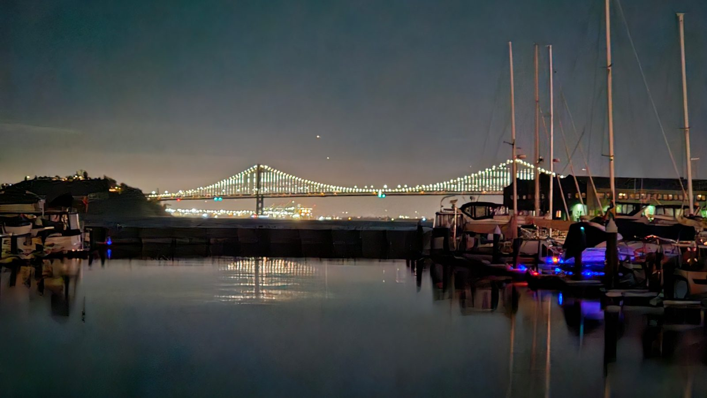

Der Tag, an dem wir das Wohnmobil abgeben und ab jetzt zu Fuß, per Uber
und Cable Car unterwegs sind. Ankunft bei Cruise America in Newark gegen
10:50 Uhr – trotz der eher knappen Anreisezeit kein Problem, die Übergabe
lief diesmal problemlos, kein langes Warten. Auch das Propan-Nachtanken
bei U-Haul nebenan war unkompliziert. Damit ist der Wohnmobil-Teil der
Reise nach zwei Wochen offiziell beendet.

Von Newark ging's per Uber weiter zum Hotel – komfortabel, aber mit 130
Dollar recht teuer. Dafür stressfrei, kein Umsteigen, kein
Gepäckschleppen.

Check-in im RIU Plaza Fisherman's Wharf konnten wir direkt machen, kein
Warten aufs Zimmer. Erstmal chillen, duschen, auspacken, ein kurzer Blick
auf den Pool, dann zu Fuß weiter Richtung Pier.

Auf Pier 39 viele Souvenirshops, die Atmosphäre erinnert stark an Las
Vegas. Erste Mitbringsel sind schon ins Auge gefasst (Nummernschilder,
T-Shirts), die Sammelrunde ist aber noch nicht abgeschlossen.

Und natürlich: die Seelöwen. Sie drängen sich alle auf ein Ponton und
schubsen sich dabei teils gegenseitig runter – ziemlich witzig anzusehen. Erst seit 1989 liegen sie an Pier 39, kurz nach
dem Loma-Prieta-Erdbeben – vorher waren sie eher an den Seal Rocks bei
Ocean Beach zu finden. Am gerade instand gesetzten K-Dock durften damals
kurzzeitig keine Boote anlegen, dazu kam ein außergewöhnlich großer
Hering-Schwarm in der Bucht – zusammen genug, damit die ersten Tiere
blieben und der Rest der Herde nachzog. Geblieben sind sie wegen der
Sicherheit (keine Haie oder Orcas in der Bucht) und weil das schwimmende
Dock mit der Tide mitgeht, statt dass sie sich ständig neu positionieren
müssten. Männchen werden bis zu 390 Kilo schwer, Weibchen deutlich
kleiner, bis 110 Kilo. Der bisherige Rekord: über 2.100 Tiere im April
2024.

Von der Cable-Car-Drehscheibe an Hyde & Beach sind wir zu Fuß die Lombard
Street hochgelaufen. Schon das normale, gerade Stück, nicht die berühmte
geschlängelte Kurve weiter oben, ist mega steil und zu Fuß ziemlich
anstrengend. Notiz für uns: nochmal zu einer anderen Tageszeit hin,
vielleicht diesmal mit der Cable Car statt zu Fuß.

Abends waren wir nochmal am Pier, um zu schauen, ob die Seelöwen auch zu
dieser Uhrzeit noch da sind – waren sie. Dazu noch schnell eine
Kleinigkeit gegessen im Wipeout Bar & Grill: Burger, Fish and Chips,
Chilli Cheese Fries. Alles lecker.

