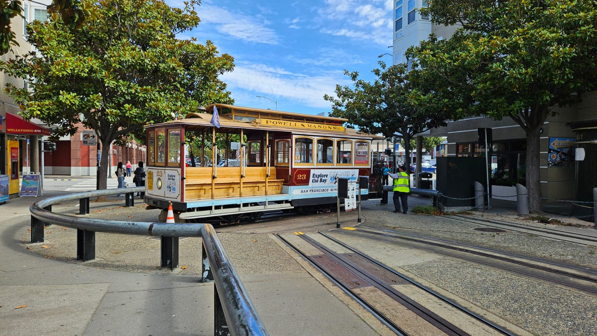
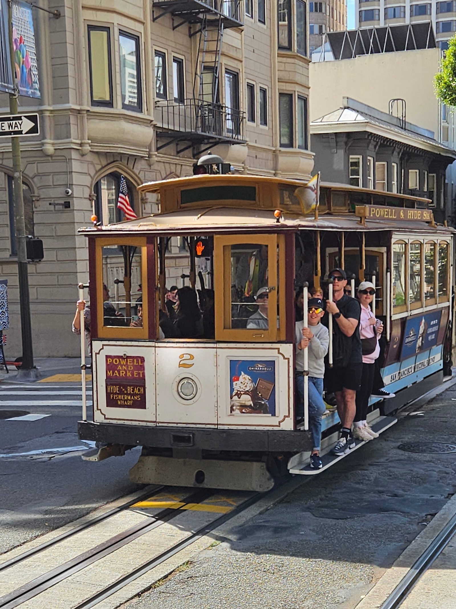
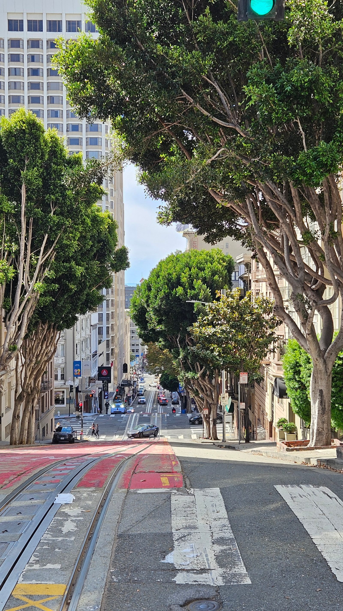
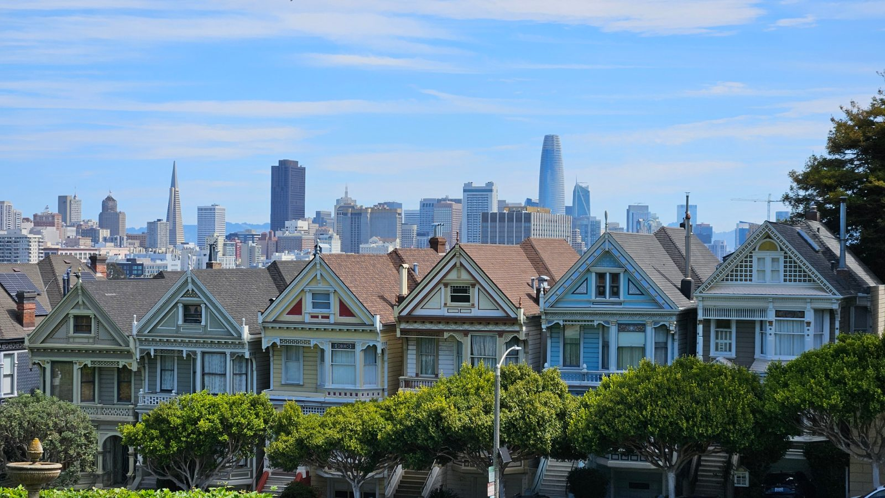
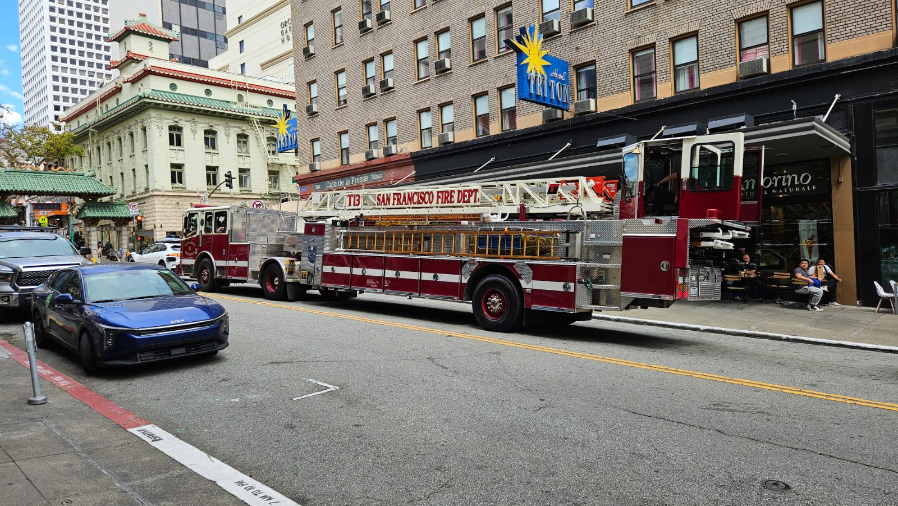
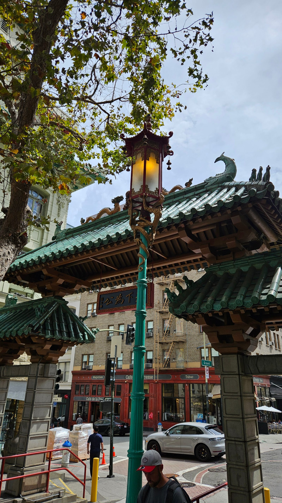
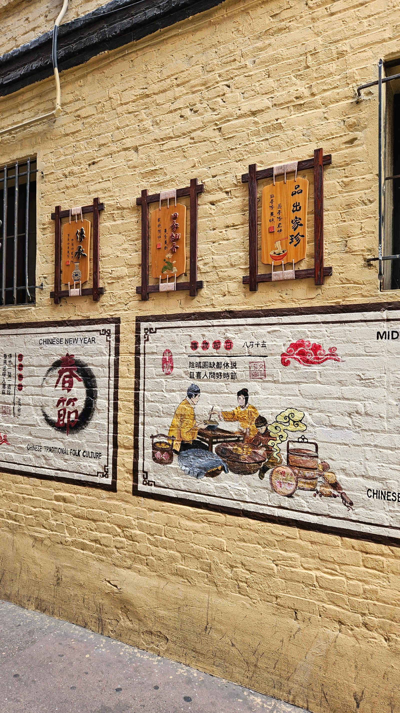
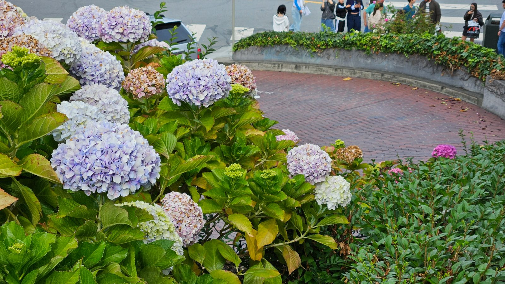
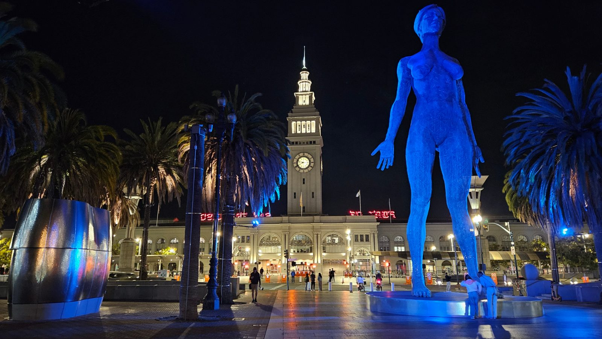

Zweiter voller Tag in San Francisco, komplett zu Fuß und mit öffentlichen
Verkehrsmitteln unterwegs.

Vormittags erst mal zur Cable-Car-Wendescheibe ganz in der Nähe vom
Hotel, dann die erste Fahrt mit dem historischen Cable Car Richtung
Union Square.

Dort umgestiegen in die F-Line, eine andere historische Straßenbahn –
die mussten wir aber kurz wieder verlassen, für einen kurzen Besuch der
City Hall. Weiter ging's dann mit dem Bus zum Alamo Square, um uns die
Painted Ladies anzuschauen.

Zurück ging's erst ein Stück zu Fuß, dann wieder mit der Bahn, Ausstieg
am Union Square. Dort haben wir uns mitten auf den Platz gesetzt und die
Beine hochgelegt. Neben einer Tischtennisplatte, einem Kicker und ein
paar Schachbrettern gab's auch Cornhole zu spielen – haben wir uns
natürlich nicht entgehen lassen.

Nach der Erholung ging's weiter ins Macy's, dazu noch ein Schuhgeschäft
und ein Urban-Streetwear-Laden. Danach hatten wir alle ziemlich
Plattfüße.

Zu Fuß hoch Richtung Chinatown, durchs Dragon Gate und die Grant Avenue
entlang. Zwei typische Läden durchstöbert, mit winkenden Pandas und
Buddhas und jeder Menge buntem Kram.

Mit großem Hunger sind wir dann im Grand Place Restaurant eingekehrt und
haben eine Familienplatte „Vier Köstlichkeiten" vernascht – sehr lecker
und megaviel, danach waren alle pappsatt. Dim Sum haben wir diesmal
nicht geschafft, das heben wir uns für den nächsten Chinatown-Besuch
auf.

Danach noch ins Cable Car Museum – richtig interessant, ein paar Fotos
gemacht, die Infotafeln lesen wir uns noch in Ruhe durch. Mit dem Cable
Car ging's dann hoch zur Lombard Street, um das Foto von gestern
nachzuholen. Diesmal hat uns die Cable Car den Berg hochgezogen, wir
mussten also nur runterlaufen und nicht wieder mühsam hochkraxeln.

Zurück im Hotel noch kurz im Minimarkt nebenan ein paar Getränke
gekauft, dann Feierabend. Für morgen steht die Fahrradtour an: vom
Fisherman's Wharf über Fort Mason, Marina und Crissy Field zur Golden
Gate Bridge, weiter nach Sausalito und mit der Fähre zurück nach Pier
41. Abends um 18:30 treffen wir Dave am Ferry Building – Essen am
Hafen, vielleicht auch noch eine kurze Fährfahrt über die Bay.

