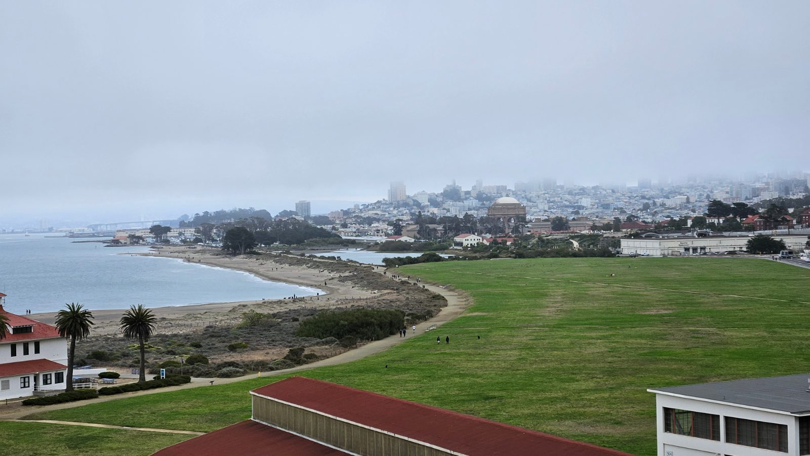
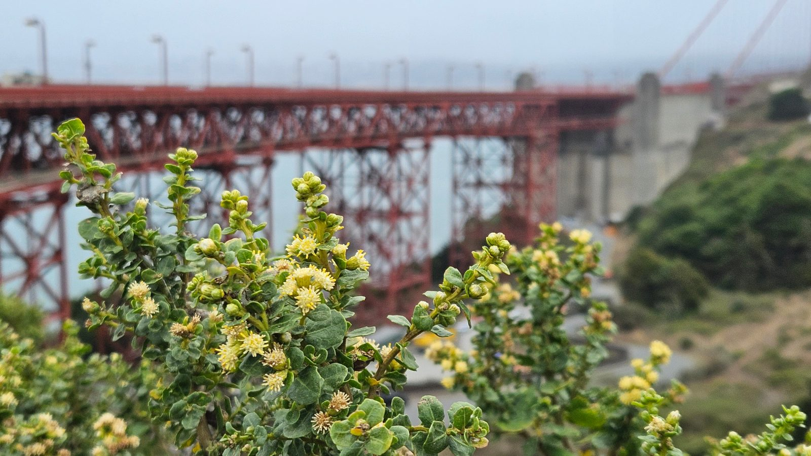
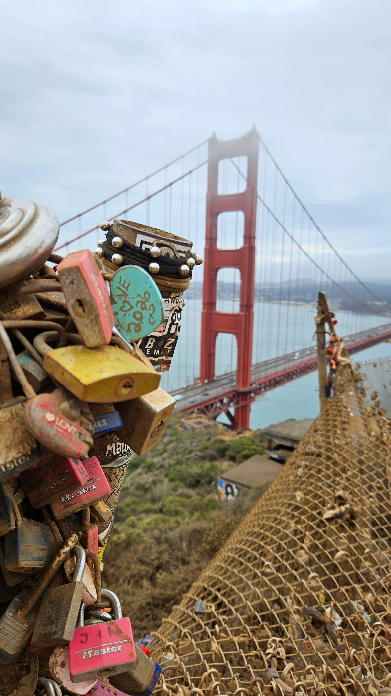
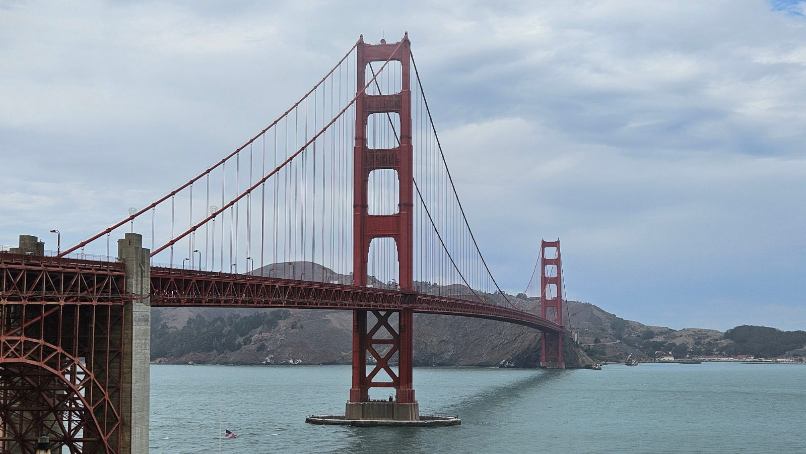
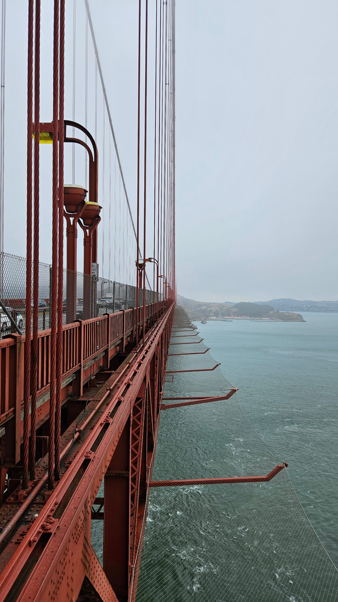
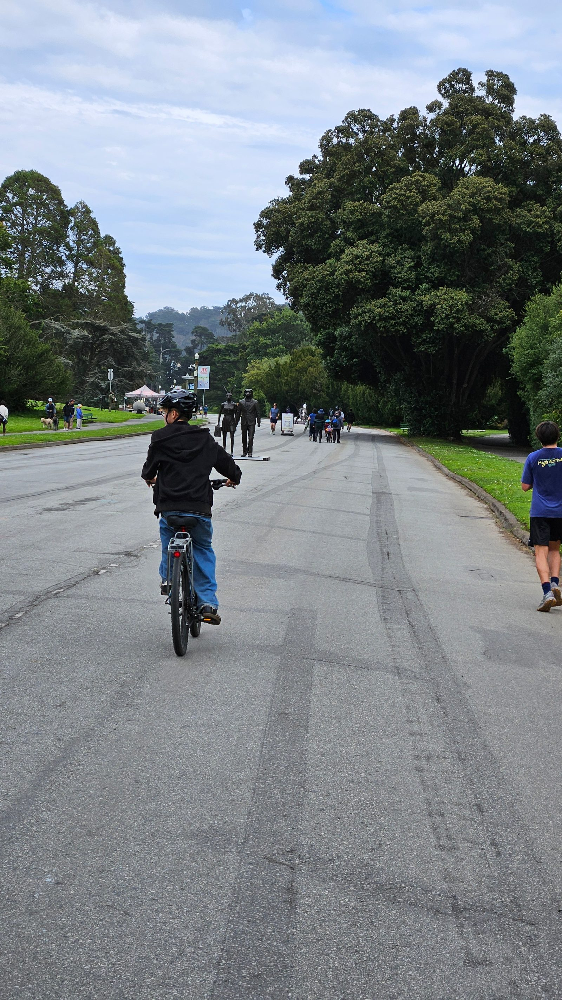
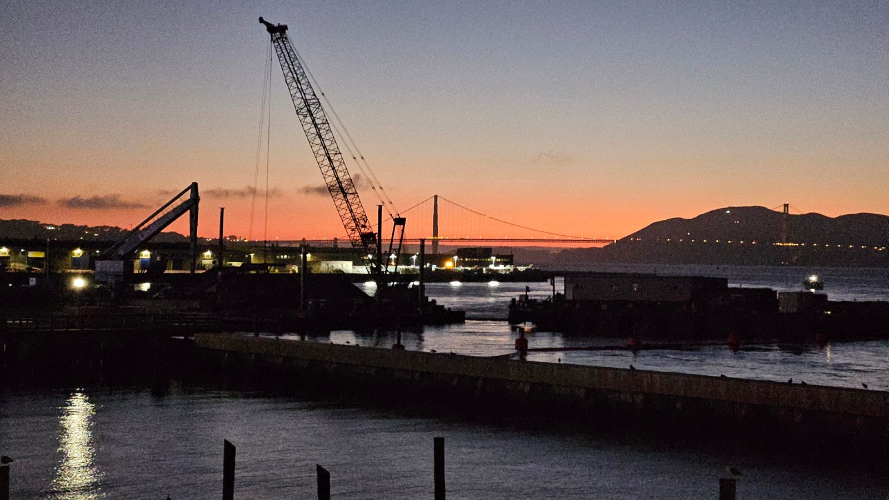
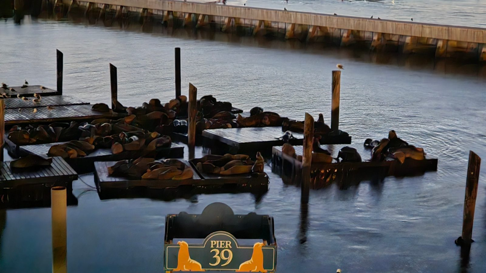
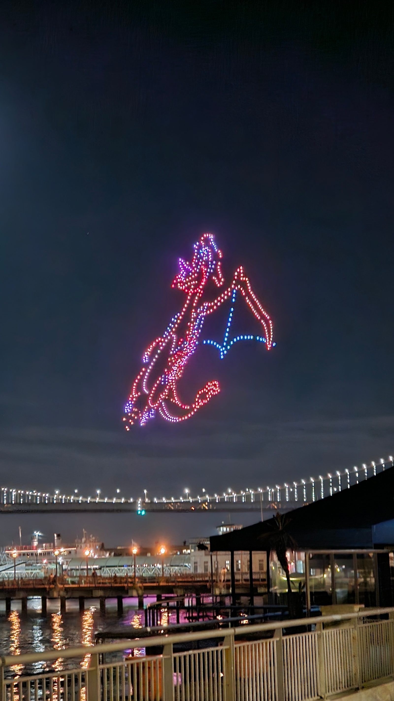

Bevor es losging: das Hotelfrühstück wieder sehr genossen – eines der
Highlights des Tages.

Los ging's mit dem Rad Richtung Golden Gate Bridge.

Statt weiter nach Sausalito zu fahren, sind wir stattdessen zur Battery
Spencer gelaufen – eine der alten Bunker-Batterien oben in den Marin
Headlands, mit Blick auf die Brücke. Zu windig zum Verweilen, aber der
Ausflug hat sich gelohnt.

Zur Brücke selbst: Geplant wurde sie schon ab 1919, gebaut dann zwischen
1933 und 1937 – vorher kam man nur mit der Fähre von San Francisco nach
Marin County. Chefingenieur war Joseph Strauss. Bei der Eröffnung 1937
war sie mit rund 1,7 Meilen (2,7 km) Länge die längste Hängebrücke der
Welt, ein Rekord, den sie bis 1964 hielt. Die Farbe – International
Orange – war ursprünglich nur eine Grundierung, hat sich dann aber
durchgesetzt, weil sie im Nebel gut sichtbar ist.

Nach dem gescheiterten ersten Versuch mit dem Hotdog-Stand sind wir auf
der anderen Seite der Brücke dann doch noch fündig geworden. Zurück
ging's nicht denselben Weg, sondern in Richtung Golden Gate Park, den
wir einmal komplett durchquert haben. Unterwegs kurzer Snack in einem
kleinen Supermarkt – und dann mit nur ein paar Minuten Puffer kurz vor
Ladenschluss beim Fahrradverleih angekommen.

Der Park selbst ist älter, als man beim Durchradeln denkt: 1870 auf gut
400 Hektar Sanddünen angelegt, damals „Outside Lands" genannt und für
viele ein aussichtsloses Projekt. San Francisco war außerdem eine der
ersten Städte in den USA, die Autos aus ihren Parks verbannt hat – ein
Teil der John F. Kennedy Drive ist bis heute autofrei, ursprünglich nur
sonntags, inzwischen dauerhaft.

Fazit: anstrengender als gedacht. Die Gesamtlänge und den Aufwand hatten
wir unterschätzt, damit hätten wir vorher nicht gerechnet. Die Räder mit
„tons of gears" haben zwar durchgehalten, waren qualitativ aber jetzt
kein Highlight. Das Personal beim Verleih war – wie eigentlich überall
bisher auf der Reise – super freundlich. Trotzdem: eine tolle Erfahrung.

Am Abend Treffen mit Dave, einem ehemaligen Kollegen und Freund – schon
am Vortag verabredet. Dave war pünktlich, saß schon in der Bahn und war
um 18:10 Uhr am Ferry Building. Wir dagegen nicht, wir also schnell los.
Auf dem Weg dorthin konnten wir immerhin noch die Golden Gate Bridge im
letzten Sonnenlicht beobachten.

Am Ferry Building sind wir bei einem Burrito-Laden fündig geworden, dann
ging's zu Fuß weiter Richtung Hotel, mit Zwischenstopp am Pier 39, um
zusammen die Seelöwen anzuschauen.

Danach sind Dave und ich noch auf ein Bier weitergezogen – ein Pale Ale
für 12,50 Dollar. Da Dave von der Bahnstation noch mit dem Auto nach
Hause musste, blieb es bei dem einen. Der Rest der Familie war da schon
im Hotel. Ganz zum Schluss noch eine kleine Sache: Am Pier 1 lief eine
Drohnenshow, die Dave und ich uns kurz angeschaut haben, bevor auch ich
zurück bin.

Sich in San Francisco mit einem alten Kollegen zu treffen – schöner
Zufall, dass sich das so ergeben hat.
